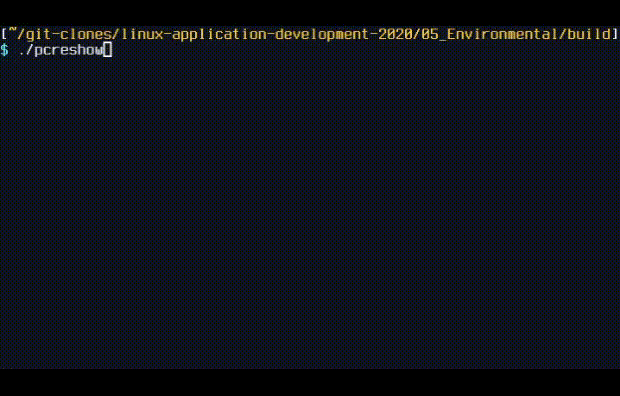

# CLI Regex Matcher

Accepts PCRE and a subject and prints out the match groups.



## Key bindings

| Key       | Action                                    |
| --------- | ----------------------------------------- |
| Shift+Tab | Switch between pattern and subject fields |
| Enter     | Print the match groups                    |
| ESC       | Quit                                      |

## Build
```console
mkdir build && cd build
```
- To build with UTF support:
  ```console
  cmake .. && make
  ```
- To build without UTF support:
  ```console
  cmake .. -Dwithout_UTF=true && make
  ```

## Execution
```console
./pcreshow
```
